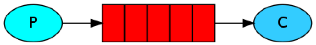
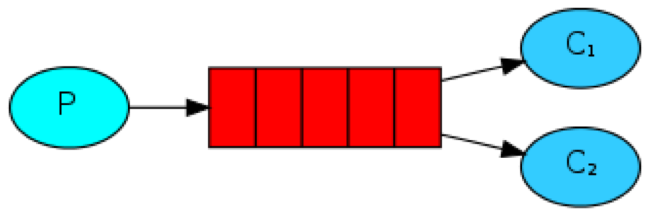
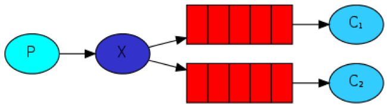
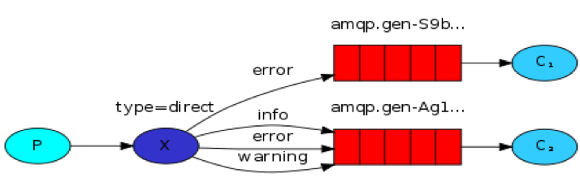
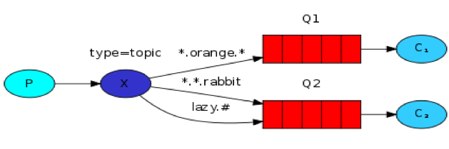

### 一、RabbitMQ主要使用场景：

> 1.程序解耦利器；
>
> 2.流量消峰；
>
> 3.异步处理；

**拓展资料：**

> ###### [RabbitMQ 的应用场景以及基本原理介绍](<https://learnku.com/articles/27446>)
>
> 
>
> #### RabbitMQ系列文章
>
> 1. [RabbitMQ在Ubuntu上的环境搭建](https://www.cnblogs.com/vipstone/p/9184314.html)
> 2. [深入了解RabbitMQ工作原理及简单使用](https://www.cnblogs.com/vipstone/p/9275256.html)
> 3. [RabbitMQ交换器Exchange介绍与实践](https://www.cnblogs.com/vipstone/p/9295625.html)
> 4. [RabbitMQ事务和Confirm发送方消息确认——深入解读](https://www.cnblogs.com/vipstone/p/9350075.html)
> 5. [使用Docker部署RabbitMQ集群](https://www.cnblogs.com/vipstone/p/9362388.html)
> 6. [你不知道的RabbitMQ集群架构全解](https://www.cnblogs.com/vipstone/p/9368106.html)

### 二、RabbitMQ核心概念：

- VirtualHost
- Connection
- Exchange
- Channel
- Queue
- Binding

### 三、RabbitMQ 工作中最常用的工作模式：

​	1、Simple模式，最简单常用的模式：

​	

​	2、Work，工作模式,一个消息只能被一个消费者获取。

​	

​	3、Publish/Subscribe，订阅模式,消息被路由投递给多个队列，一个消息被多个消费者获取。

​	4、Routing，路由模式,一个消息被多个消费者获取。并且消息的目标队列可被生产者指定。

​	5、Topic，话题模式,一个消息被多个消费者获取。消息的目标queue可用BindingKey     以通配符， (#：一个或多个词，*：一个词)的方式指定。

